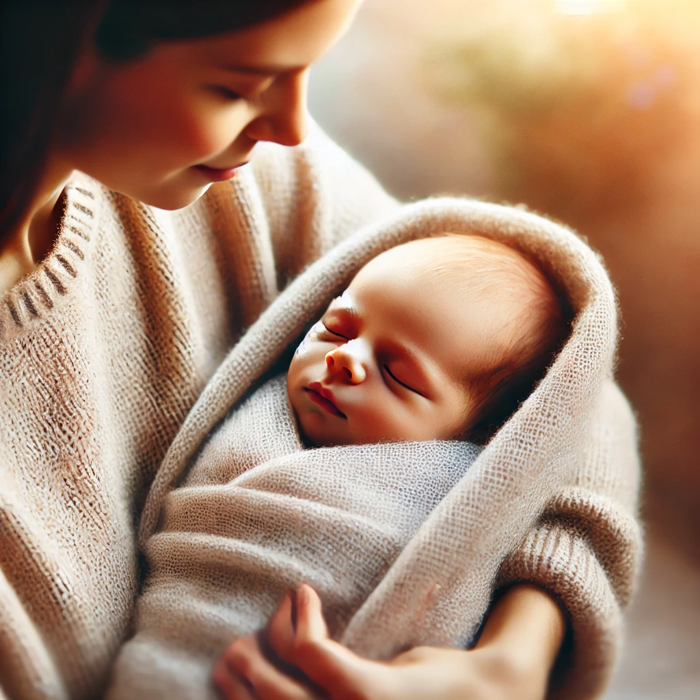
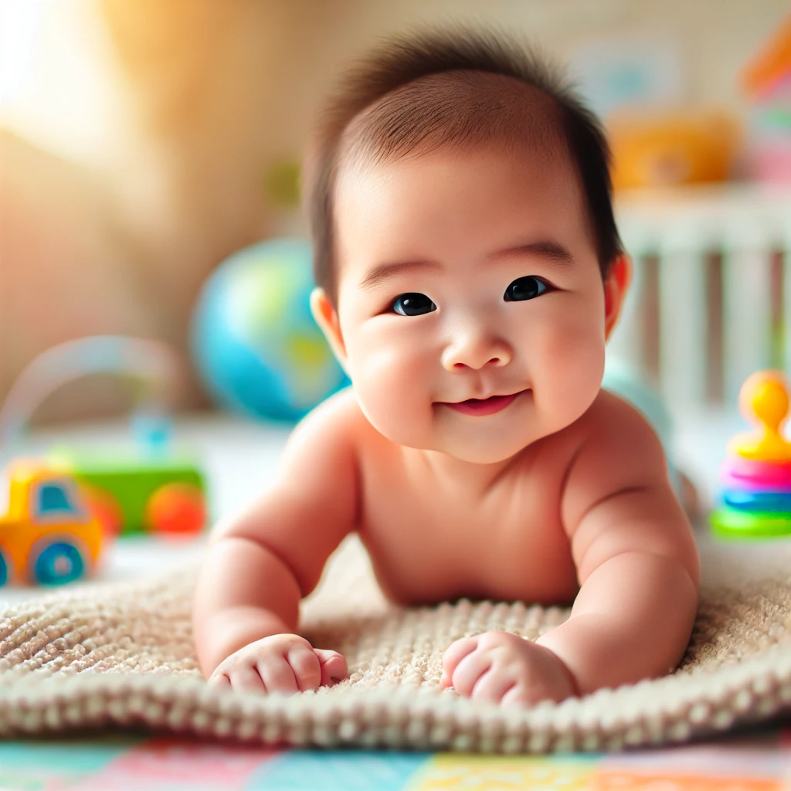
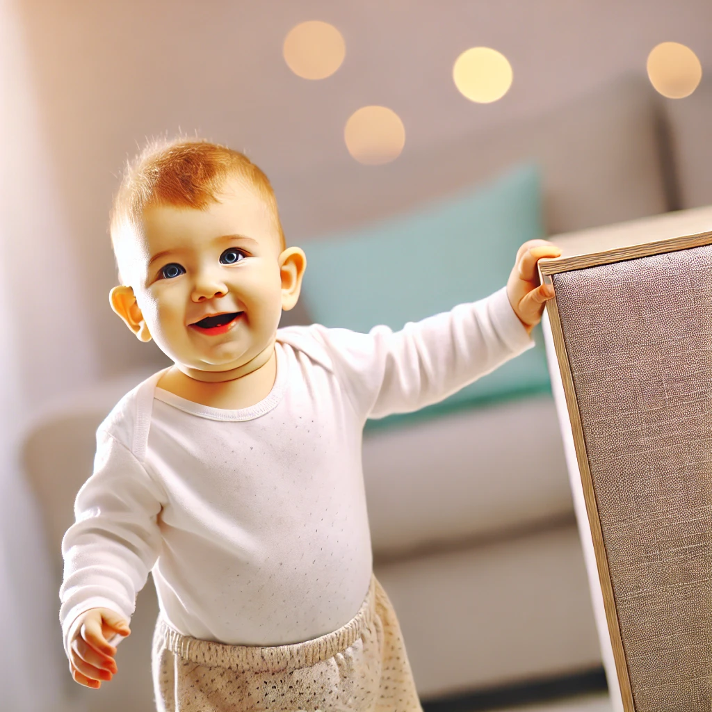
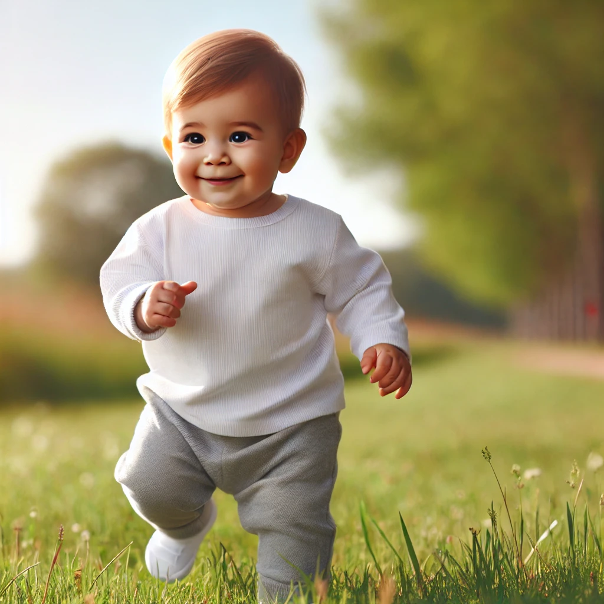
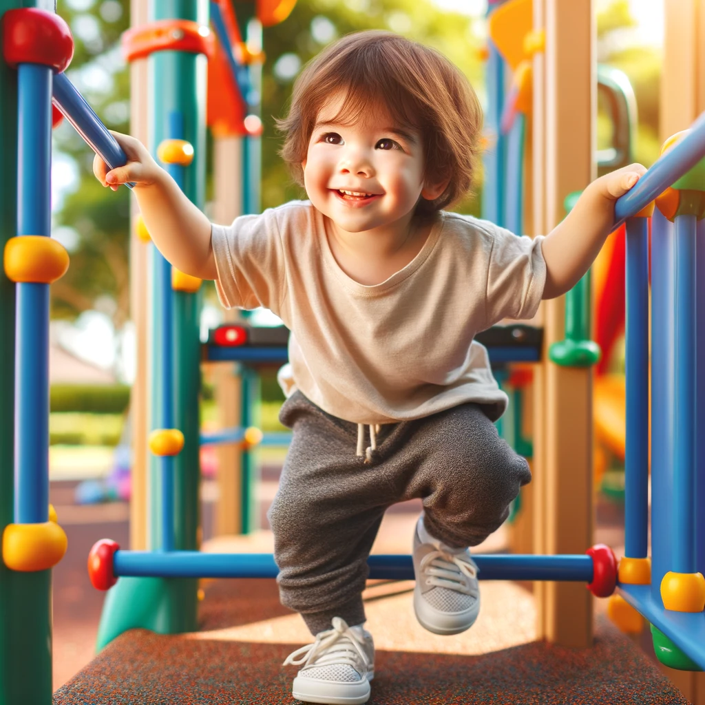
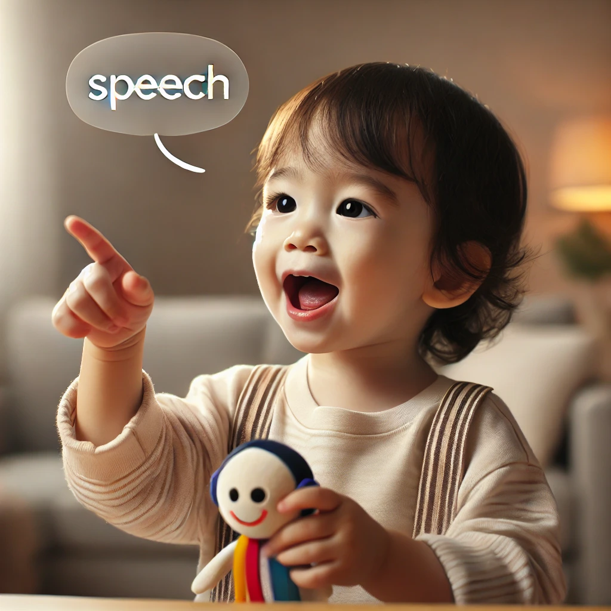
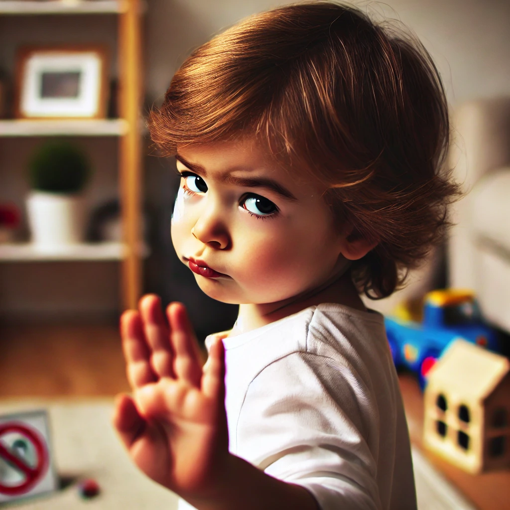
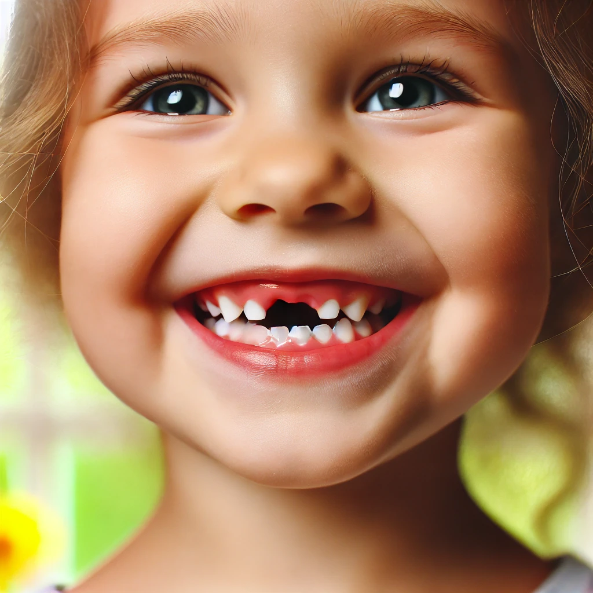

# Task 6 - Child developmental stages subject (500 words).

Opened: Friday, 16 August 2024, 11:50 PM
Due: Sunday, 25 August 2024, 11:58 PM

approaches for each developmental stage (0-7, 7-14, 14-21 years) according to Steiner's philosophy.

Take this opportunity to explore other Child developmental stages resources, in addition to Bernadette White’s lecture. 

- **Curriculum Philosophy:**
  - In Steiner (Waldorf) education, the curriculum is not a checklist of content to be covered.
  - Focus is on the holistic development of the child.
  - The goal is to understand child development to recognize and support the new faculties that emerge as the child grows.
  - The curriculum is a response to the child's developmental needs rather than a fixed set of topics.

## Child Development and Incarnation

### Incarnation Process
  - Child development is viewed as the process of the soul and spirit (referred to as the "astral" and "ego" in Steiner's terminology) fully incarnating into the physical body, which includes both the etheric and physical aspects.
  - The physical body is considered a genetic vessel, and the process of these higher bodies integrating with it takes approximately 21 years.
  - This unfolding occurs in rhythmic cycles.
  - Children come into this world from the spiritual realm, carrying experiences and intentions for their coming life.
  - These intentions include perfecting aspects of themselves and aligning with other spiritual beings.
  - As educators and parents, we must honor and respect the spiritual journey of the child and support the unfolding of these intentions.

## First Phase of Development: (0 to Age 7)

 
#### Newborn: 
  
  - 
  - In the earliest stages of life, a child is deeply connected to the mother, almost indistinguishable from her.
  - The child has no filters and is entirely at one with the world around them.
  - It is crucial to protect the child from the overwhelming bombardment of sensory experiences in the world.

#### 6 months: Raising head  
  - The child gradually awakens to an experience of their own selfhood.
  - The first conscious experience of self occurs in the body as the child starts to move their head intentionally, sit up, crawl, and eventually walk by the end of the first year.
    - 
  - This development signifies a necessary separation from the mother, enabling the child to begin exploring the world independently.

####  1 year: Standing upright  
  - The ability to stand upright by the end of the first year is considered an essential human capacity.
      - 

#### 1 - 2 years: Development of Physical and Cognitive Capacities   

  - Over the second year, the child continues to develop essential physical capacities such as running,climbing, grasping, and other forms of sensory-motor skills.
    -   
    -   
  
   
  - These developments culminate in the emergence of speech by the end of the second year, marking another fundamental human ability.
    -  

#### 3 years: Emergence of the "I": 
  - In the third year, the child begins to use the word "I," signifying the development of a sense of self as a distinct being separate from others.
  - This stage is often accompanied by the use of the word "No," expressing the child's newfound understanding of their own will and individuality.
    - 
  - Thinking also begins to develop, and the foundations of memory start to form during this year.
    - Early memory formation relates to place or location, followed by rhythmic memory, and finally, image memory.
    - Modern lifestyles can challenge these natural developmental processes, potentially impairing the child’s capacity for memory and imagination.

#### Importance of the First Three Years 
  - The first three years are crucial for laying the foundation for the entire lifespan.
  - During these years, the child is developing their 12 senses, which are gateways between the inner self and the outer world.
  - Unstructured play is essential for sensory-motor integration, allowing children to explore the sensory world and master their physical relationship with it.

### Completion of the First Phase: 0-7 years 
  - The first major phase of development concludes around the age of 7, marked by the change of teeth.
  - 
  - This physical milestone is seen as an outer indicator of the completion of this stage.

## Transition to the Second Phase of Development (Age 7 to 14)

### A note on Attention and the Etheric Body 

  - At around 7 years of age, the etheric body, which was previously focused on the physical growth of the child, becomes available to support learning and memory. This transition marks the beginning of the child’s readiness for more structured education.
  - During this stage, the child’s senses, which have been developed through foundational experiences like standing, speaking, and thinking, now play a critical role in engaging with and understanding the outside world.
  - As the etheric body shifts its focus, the child’s ability to concentrate and sustain attention on tasks begins to develop. This growing capacity for focused attention is critical for engaging with educational activities and understanding the world around them.
  - Prior to this stage, starting formal education too early might disrupt the natural maturation of the etheric body, potentially impacting both the child’s health and their ability to fully integrate their physical and cognitive capacities.

### Primary School Years (Ages 7 to 9)
- By the time a child enters primary school, they have undergone significant development. The etheric body is now ready to support learning and memory.
- The 7-year-old child is strongly interested in learning and remains immersed in a sense of wonder about the world. However, unlike the first seven years where learning occurs through imitation, the primary school years focus on language, stories, and the use of imagination through words.
- Children at this stage look to adults for stories and kind words of recognition. Teachers should be authentic in their communication, using specific and meaningful praise rather than generic compliments.

### Development of Memory 
- Between ages 7 and 9, children's memory develops to a more continuous form. Rhythmic memory, supported through activities like learning long poems, plays a crucial role in this development.
- Rhythmic exercises also support the etheric body, helping to anchor the learning process.

### The 9-Year Crisis
- Around the age of 9, children experience what is often referred to as the "loss of paradise." This developmental milestone marks a transition where children begin to lose their previous openness and wonder about the world.
- This period is akin to the process humanity itself has undergone, as children begin to separate themselves to become more individual. They become more aware of the world but can also feel more vulnerable and insecure.
- During this time, it is important for teachers to provide reassurance and to introduce concepts of lawfulness and order, such as through stories from the Old Testament.
- Teachers should embody authority not by imposing their will but by standing as a human being who has worked on themselves and who carries the heritage of humanity.

### Expanding the Child’s World (Ages 9 to 11)
- After the 9-year crisis, children are introduced to subjects that help them engage with the world in new ways, such as housebuilding, farming, and trade. These activities teach them how humans work with the world, instilling a sense of respect and reverence for it.
- In classes 4 and 5, children become capable of handling more abstract concepts like fractions. Their thinking becomes more refined, and they can create more complex mental images. Studies also expand to include plants, animals, and a broader range of stories, such as Norse myths.
- Class 5 is considered a year of balance, both physically and socially, and it introduces botany, focusing on the purity of the plant world. The curriculum also broadens to include stories from India, Persia, and Greece.

### Approaching Pubescence (Ages 11 to 14)
- As children enter year 6, they begin the transition into pubescence. This period requires bringing children more into their thinking without becoming overly abstract while continuing to engage their will.
- Boys, in particular, start to incarnate more deeply into their bodies, experiencing changes in bones and muscles. This physical development can lead to feelings of discomfort and vulnerability as they adjust to their changing bodies.
- During this time, it is important to establish clear boundaries in the classroom. Some teachers encourage the creation of a classroom senate with laws, helping children navigate this period of change.
- Teachers should be sensitive to the children's experience of physical and spiritual weight. Stories like those of King Arthur, along with science and observation work, are introduced to help ground the children in truth and provide a foundation for their development.

## Third Phase of Development (Age 14 to 21)

- **Entrance into a New Life Phase:**
  - The third phase marks the entrance into a new phase of life.
  - This period is characterized by the growing independence of the individual and the full integration of the ego or "I" being into the physical and etheric bodies.
  - This stage is about the young person finding their place in the world and beginning to fulfill their unique life path.

## Archetype of Child Development

- **Guiding Principle:**
  - Steiner also spoke of an archetypal pattern of child development, where the goal is to facilitate the child in becoming a truly noble human being.
  - This archetype serves as a guiding principle for educators and parents in supporting the child's growth and development.

## References

- Steiner, R. (1996). *The Education of the Child and Early Lectures on Education*. Anthroposophic Press.
- Steiner, R. (2004). *Human Values in Education*. Rudolf Steiner Press.
- Glöckler, M. (2009). *A Guide to Child Health: A Holistic Approach to Raising Healthy Children*. Floris Books.
- all images courtesty of OpenAI.
