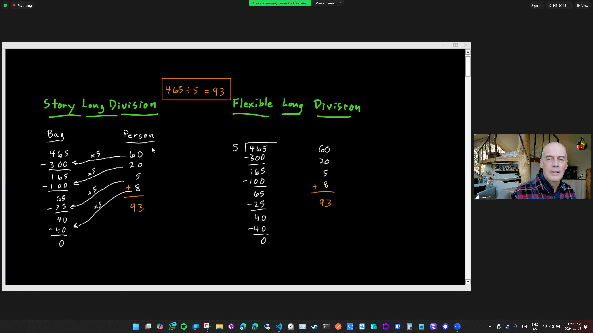
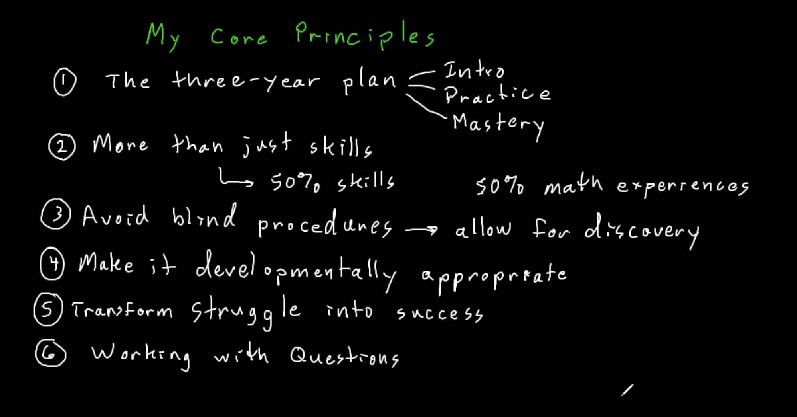

  # Long Division

  

# Jamies House & Recap from First Session
Jamie building his house of phi https://www.youtube.com/watch?v=TCbXNHgrBHY

Maths is not just a lanugage, it is an adventure

Maths should be discovered.

## divisibity rule of 3 add numbers like
537/3 ?  
5 + 3 + 7 = 15 which is divisble by 3

## divisibity rule of 9
number sum  = 9 or a multiple of 9

111 
117 =  9 / 9

126 = good
456 = 15 
459 =
1755
67482 =  6 + 4 +8 + 2 is  27 

## Forest theroem

start with any square number like 25
write all squre numbers till u get to end to 1

25 - 16  + 9 - 4 +1 = 15  -> 5th triangular number

# Jamie's core principles:

 

## The 3 year plan 
  When ure worried when students are not learning quick enough.  In order to reach mastery on any topic like fractions, algebra we working to get there by 3rd year. First year is introduction, 2nd year is practice.

## More to Math than just skills
50/50 division between working on skills vs mathematical experiences.
mathematical experience  like the discovery excercices of finding patterns.

## Avoid blind procedures
 Its when a teacher is just telling the student what to do..like long division or the pythagoream theorem. Allow blind procedures and allow for discovery

##  Make it developmentally appropriate
We are looking at when is it the best time for the student to learn this material. There is not this race to get ahead.

## Struggle
   Transform Struggle into success

## Working with Questions
   When the teacher answers all the questions before the student even has the question i.e telling students the area of a circle  instead of posing the question to the children.